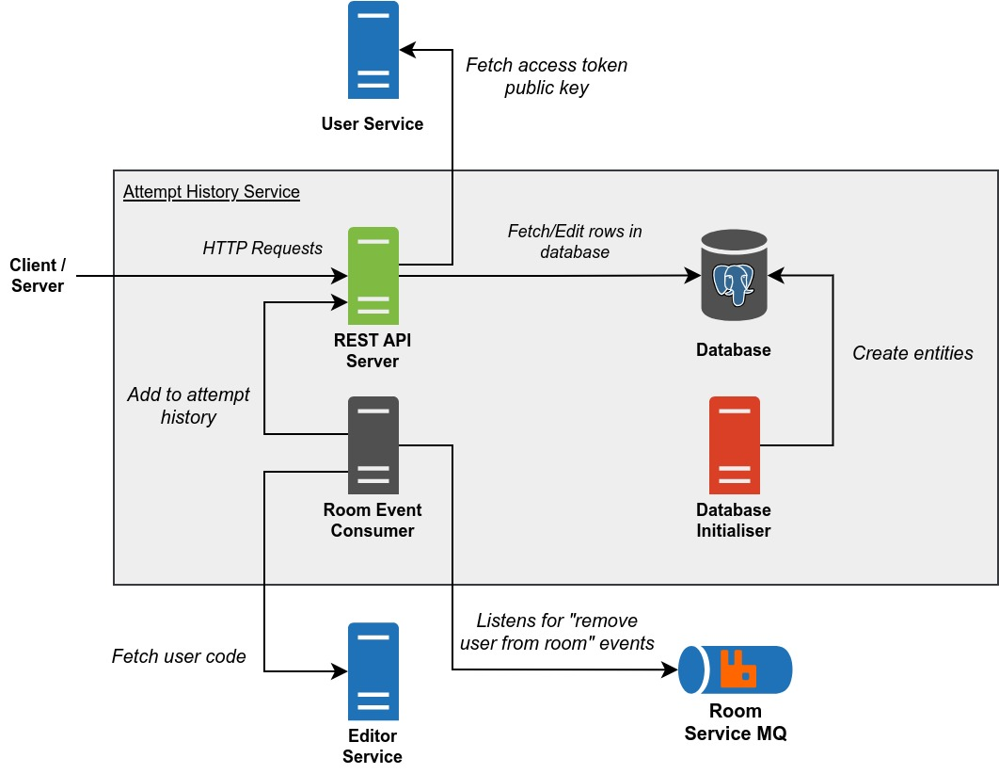

# PeerPrep Attempt History Service

Keeps track of the user's attempts.

- [Build Script](#build-script)
- [Architecture](#architecture)
- [Docker Images](#docker-images)
  - [API](#api)
  - [Database Initialiser](#database-initialiser)
  - [Room Event Consumer](#room-event-consumer)
- [Deployment](#deployment)
  - [Kubernetes Deployment](#kubernetes-deployment)
  - [Docker Compose Deployment](#docker-compose-deployment)
- [REST API](#rest-api)
  - [Get user attempt history](#get-user-attempt-history)
  - [Get user attempt code](#get-user-attempt-code)
  - [Add to attempt history](#add-to-attempt-history)
  - [Rank all users by attempt count](#rank-all-users-by-attempt-count)

## Build Script

`build_images.sh` is a build script for building the Docker images and optionally pushing them to the container registry. To get more information about the script, run:

```
./build_images.sh -h
```

## Architecture



Legend:

- Start of arrow indicates request origin and end of arrow indicates request destination.
- `#505050` Dark grey items represents internal servers/containers.
- `#DA4026` Red items represents internal servers/containers that are temporary.
- `#7FBA42` Green items represents internal servers/containers that are exposed.
- `#2072B8` Blue items represents external servers/containers.

**REST API Server**

- Handles REST API requests.
- Can be scaled horizontally.
- Corresponds to the [API](#api) docker image.

**Database Initialiser**

- Creates entities in the database.
- Does nothing if the database already contains one or more entities it intends to create (behaviour can be changed via environment variables).
- Shuts down once it is done initialising the database.
- Corresponds to the [Database Initialiser](#database-initialiser) docker image.

**Room Event Consumer**

- Consumes "remove user from room" events from the Room Service MQ and sends a request to the REST API server to add attempt history.
- Can be scaled horizontally.
- Corresponds to the [Room Event Consumer](#room-event-consumer) docker image.

**Database**

- Database for storing attempt history.

## Docker Images

### API

**Name:** ghcr.io/cs3219-ay2324s1-g04/peerprep_attempt_history_service_api

**Description:** Runs the REST API.

**Environment Variables:**

- `DATABASE_USER` - Username of the user in the database.
- `DATABASE_PASSWORD` - Password of the user in the database.
- `DATABASE_HOST` - Address of the database host.
- `DATABASE_PORT` - Port the database is listening on.
- `DATABASE_SHOULD_USE_TLS` - Should database connection be secured with TLS. Set to "true" to enable.
- `DATABASE_NAME` - Name of the database.
- `DATABASE_CONNECTION_TIMEOUT_MILLIS` - Number of milliseconds for a database client to connect to the database before timing out.
- `DATABASE_MAX_CLIENT_COUNT` - Max number of database clients.
- `USER_SERVICE_HOST` - Address of the User Service host.
- `USER_SERVICE_PORT` - Port the User Service is listening on.
- `API_PORT` - Port to listen on.
- `NODE_ENV` - Mode the app is running in ("development" or "production").

### Database Initialiser

**Name:** ghcr.io/cs3219-ay2324s1-g04/peerprep_attempt_history_service_database_initialiser

**Description:** Initialises the database by creating the necessary entities.

**Environment Variables:**

- `DATABASE_USER` - Username of the user in the database.
- `DATABASE_PASSWORD` - Password of the user in the database.
- `DATABASE_HOST` - Address of the database host.
- `DATABASE_PORT` - Port the database is listening on.
- `DATABASE_SHOULD_USE_TLS` - Should database connection be secured with TLS. Set to "true" to enable.
- `DATABASE_NAME` - Name of the database.
- `DATABASE_CONNECTION_TIMEOUT_MILLIS` - Number of milliseconds for a database client to connect to the database before timing out.
- `DATABASE_MAX_CLIENT_COUNT` - Max number of database clients.
- `SHOULD_FORCE_INITIALISATION` - Should database initialisation be done regardless of whether one or more entities to be created already exist. Set to "true" to enable (may cause data loss).

### Room Event Consumer

**Name:** ghcr.io/cs3219-ay2324s1-g04/peerprep_attempt_history_service_room_event_consumer

**Description:** Listens for "remove user from room event" from the Room Service MQ and adds an attempt history when such events are consumed.

**Environment Variables:**

- `API_HOST` - Address of Attempt History Service API Server.
- `API_PORT` - Port of Attempt History Service API Server.
- `ROOM_SERVICE_MQ_USER` - User on the Room Service MQ host.
- `ROOM_SERVICE_MQ_PASSWORD` - Password of the Room Service MQ.
- `ROOM_SERVICE_MQ_HOST` - Address of the Room Service MQ host.
- `ROOM_SERVICE_MQ_PORT` - Port the Room Service MQ is listening on.
- `ROOM_SERVICE_MQ_VHOST` - Vhost of the Room Service MQ.
- `ROOM_SERVICE_MQ_SHOULD_USE_TLS` - Should Room Service MQ connection be secured with TLS. Set to "true" to enable.
- `ROOM_SERVICE_MQ_EXCHANGE_NAME` - Name of the Room Service MQ exchange.
- `ROOM_SERVICE_MQ_QUEUE_NAME` - Name of the Room Service MQ queue.
- `USER_SERVICE_HOST` - Address of the User Service host.
- `USER_SERVICE_PORT` - Port the User Service is listening on.
- `DOCS_SERVICE_HOST` - Address of the Docs Service host.
- `DOCS_SERVICE_PORT` - Port the Docs Service is listening on.

## Deployment

### Kubernetes Deployment

This is the main deployment method for production.

**Note:**

- The database is hosted externally, not within the Kubernetes cluster.

**Prerequisite**

- Docker images must be pushed to the container registry and made public.
  - To push to the container registry (assuming one has the necessary permissions), run: `./build_images.sh -p`
  - To make the images public, change the visibility of the image on [GitHub](https://github.com/orgs/CS3219-AY2324S1-G04/packages).
- Kubernetes cluster must be setup as specified in the [main repository](https://github.com/CS3219-AY2324S1/ay2324s1-course-assessment-g04#deployment).
- User Service and Docs Service must be deployed within the Kubernetes cluster.

**Steps:**

1. Ensure the "peerprep" namespace has been created: `kubectl create namespace peerprep`
2. Navigate to the "kubernetes" directory: `cd kubernetes`
3. Deploy the Kubernetes objects: `./deploy.sh`
    - To delete the Kubernetes objects, run: `./delete.sh`

### Docker Compose Deployment

This is intended for development use only. It is meant to make developing other services easier.

**Note:**

- No horizontal auto scaling is provided.
- The database is created by Docker compose and data is not backed up.

**Prerequisite**

- Docker images must be built.
  - To build the images, run: `./build_images.sh`
- User Service and Docs Service must be deployed via Docker compose.

**Steps:**

1. Ensure that the "peerprep" network exist: `docker network create -d bridge peerprep`
2. Create the docker containers: `docker compose up`
    - To delete the docker containers, run: `docker compose down`

## REST API

### Get user attempt history

> [GET] `/attempt-history-service/`

**Cookies**

- `access-token` - Access token.

**Returns**

- `200` - { message: "Success",  data : [{"attemptId":string,"questionId":string,"language":string,"date":date}] }
- `401` - { message: "Not authorized" }
- `500` - { message: "Sever Error" }

### Get user attempt code

> [GET] `/attempt-history-service/:aid`

This returns a particular user's attempt, in particular their code.

Note that the code return is in raw form, so there could be code injection present.

**Params**
- `aid` - The attempt id.

**Cookies**

- `access-token` - Access token.

**Returns**

- `200` - { message: "Success",  data : user's code }
- `401` - { message: "Not authorized" }
- `500` - { message: "Sever Error" }

### Add to attempt history

> [POST] `/attempt-history-service/add`

Note that (user id, room id) is considered primary keys. That is to say, their combination is what makes an entry unique.

WARNING: This endpoint is potentially abusable. It should be inaccessible by the frontend.

**Parameters**

- `user` - The user id
- `question` - The question id
- `room` - The room id
- `language` - The language id

**Body**
- Json with the key being 'code' and the value being the user's code.

**Returns**

- `200` - { message: "Success" }.
- `500` - { message: "Sever Error" }

**Examples**

> `attempt-history-service/add?user=4&question=4&room=fb137075-1ce0-4303-9e47-5182dac23a41&language=cpp`

> body `{ code : 'lorem ipsum' }`

This will create an entry for the user.

### Rank all users by attempt count

> [GET] `/attempt-history-service/all`

Rank all users by attempt count and sort them by user id and count.

**Returns**

- `200` - { message: "Received message", {"data": [
        {"user-id": number, "attempt_count": string}]}}.
- `500` - { message: "Server Error" }
